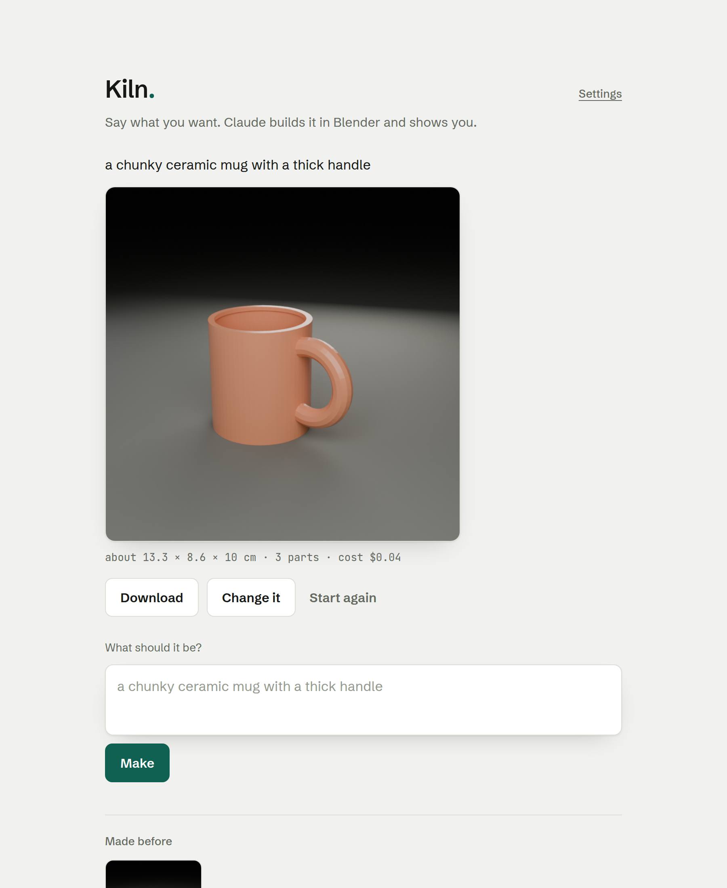
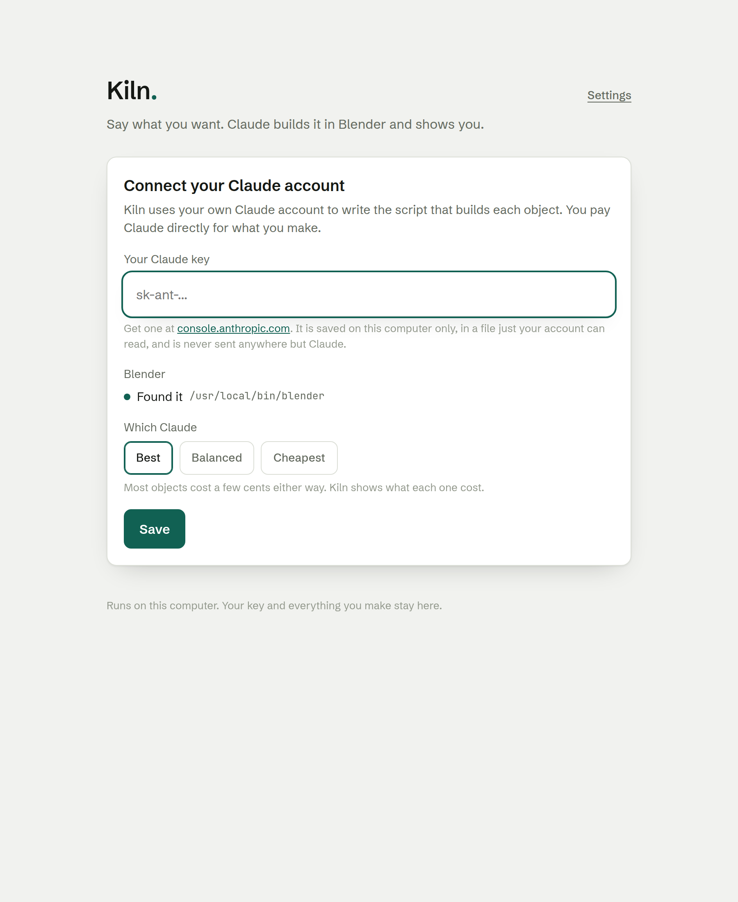
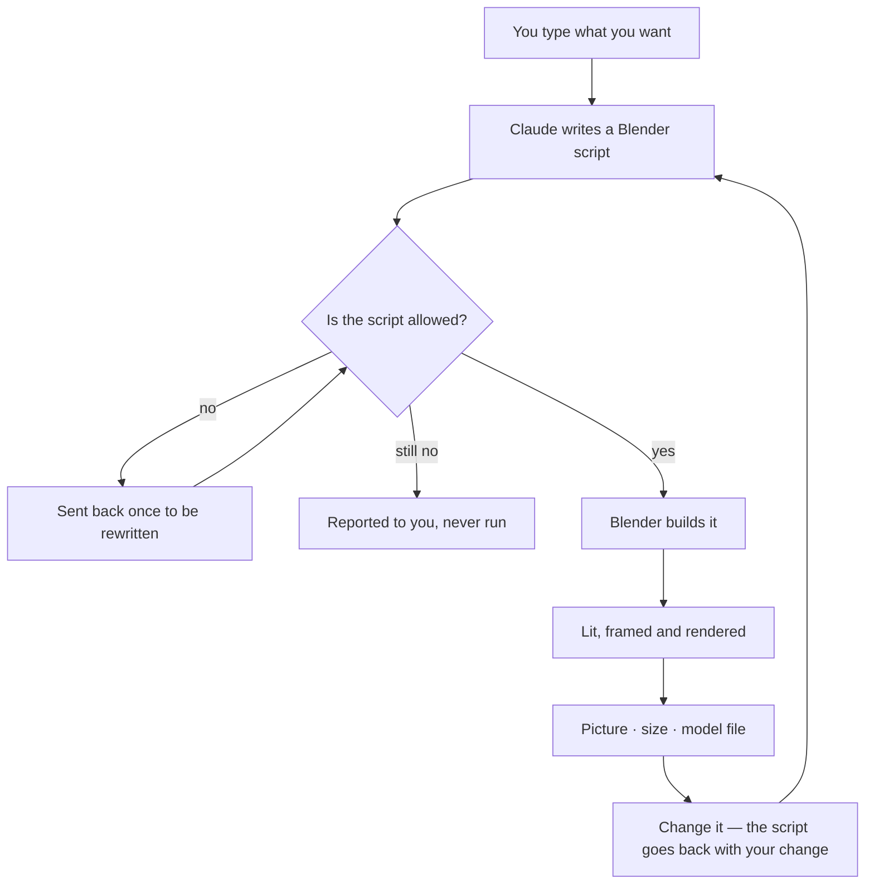
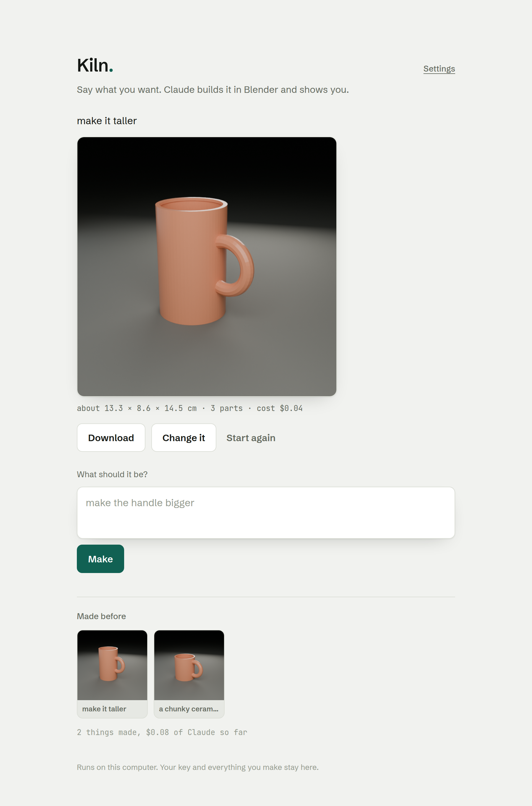

<h1 align="center">Kiln</h1>

<p align="center">
  <strong>Say what you want. Claude builds it in Blender and shows you.</strong>
</p>

<p align="center">
  <a href="#get-it">Get it</a> ·
  <a href="#have-an-ai-set-it-up-for-you">Let an AI install it</a> ·
  <a href="#how-it-works">How it works</a> ·
  <a href="#what-it-costs">Cost</a> ·
  <a href="#safety-said-plainly">Safety</a>
</p>

<p align="center">
  
</p>

---

Type **a chunky ceramic mug with a thick handle**. Press **Make**. About fifteen
seconds later you have a picture, the real size in centimetres, and a 3D model
you can open in anything.

Then press **Change it** and say *make the handle bigger*. It keeps the mug and
adjusts it, rather than starting over.

That is the whole app. There is nothing else to learn.

---

## Have an AI set it up for you

Kiln ships with a file called [`AGENTS.md`](AGENTS.md) written for coding
agents. Paste this into **Claude Code**, **Codex**, **Cursor**, or anything
that can run commands:

```
Install Kiln for me from https://github.com/Coder-ux-coder/kiln
Follow AGENTS.md in that repo.
```

It will clone the repo, run the setup script, install what is missing, build a
test object to prove it works, start the app, and hand you the browser window.
It takes about three minutes.

`AGENTS.md` tells it one thing firmly: **never ask you for your Claude key.**
Kiln asks for that itself, in its own window, and writes it somewhere only your
account can read. No agent needs to see it.

---

## Get it

### The easy way — download it

Grab the file for your computer from [**Releases**](../../releases) and open it.
No Python, no terminal, nothing to install.

| Your computer | File |
| --- | --- |
| Mac (Apple Silicon) | `kiln-macos-arm64` |
| Windows | `kiln-windows-x64.exe` |
| Linux | `kiln-linux-x64` |

> The first time you open it, macOS wants **right-click → Open** and Windows
> wants **More info → Run anyway**. Kiln is not code-signed yet.

### The one-command way — from source

```sh
git clone https://github.com/Coder-ux-coder/kiln.git
cd kiln
bash setup.sh          # Windows: powershell -ExecutionPolicy Bypass -File setup.ps1
```

The script makes a private Python environment beside the code, installs the one
dependency, finds Blender, and builds a test object to prove the whole chain
works. Safe to run twice. Then:

```sh
./.venv/bin/python app.py
```

---

## The two things Kiln needs

It asks for both on the first run and remembers them.

<p align="center">
  
</p>

**Blender** — free, from [blender.org/download](https://www.blender.org/download/).
Kiln looks in the usual places first and normally finds it by itself.

**Your Claude account** — a key from
[console.anthropic.com](https://console.anthropic.com/settings/keys). You pay
Claude directly for what you make. Kiln takes nothing, adds nothing, and has no
account of its own.

---

## How it works



The guard in the middle is the part that matters, and it is covered under
[Safety](#safety-said-plainly).

**Change it** is why the app feels like working with someone rather than
rolling dice: your change is sent along with the script that built the current
object, so the thing keeps its identity instead of being rebuilt from nothing.

---

## Everything you make stays

<p align="center">
  
</p>

Every object is a folder on your computer with a picture, a `.glb` model, the
Blender file, and the script that built it. Click any thumbnail to bring it
back and keep changing it.

| | Where |
| --- | --- |
| Mac | `~/Library/Application Support/Kiln` |
| Windows | `%APPDATA%\Kiln` |
| Linux | `~/.config/kiln` and `~/.local/share/kiln` |

Ordinary folders. Copy them, back them up, delete them.

---

## What it costs

You pay Anthropic directly, at their published rates. Kiln reads the token
count back from the API and prices it, so every object shows what it cost and
the page keeps a running total.

| Setting | Model | Roughly |
| --- | --- | --- |
| **Best** | Claude Opus 5 | a few cents an object |
| **Balanced** | Claude Sonnet 5 | under half that |
| **Cheapest** | Claude Haiku 4.5 | under a quarter |

Blender costs nothing and runs on your own machine, so the render is free
however long it takes.

---

## Is it working?

```sh
./.venv/bin/python app.py --check
```

Builds one test sphere and tells you whether Blender and Kiln agree. Costs
nothing, needs no internet, and never touches your key.

```
  Blender: /usr/local/bin/blender
  Built and rendered a 10.0 cm sphere in 11.2s (498 KB picture, 69 KB model).
  Claude:  connected …1f4a

  Everything Kiln needs is working.
```

---

## Safety, said plainly

Claude writes code and Kiln runs it in Blender. That is the deal, and it is
worth understanding before you use it.

Before any script runs, it is checked. Six imports are allowed — `bpy`,
`bmesh`, `math`, `mathutils`, `random`, `colorsys` — and everything else is
refused: file access, the network, the shell, dunder attributes, and the
Blender operators that reach outside the job folder. A refused script goes back
to Claude once for a rewrite, and if it comes back refused again it is reported
to you rather than run.

**That is a guard, not a sandbox.** It raises the cost of a bad script; it does
not make one harmless.

It is an acceptable trade on your own machine, with your own key, building your
own things — which is exactly what Kiln is. It would **not** be acceptable as a
public website where strangers submit prompts to a server you own. If you ever
run it that way, Blender needs to be in a container with no network and nothing
writable outside the job folder. Kiln binds to `127.0.0.1` so that stays a
deliberate decision rather than an accident.

Your key is written to a file only your account can read. It never appears in
the page, in a log, or in any response — only its last four characters, so the
app can say *Connected …1f4a*.

---

## The code

Six files, about a thousand lines, no framework.

| File | What it does |
| --- | --- |
| [`app.py`](app.py) | Starts it, picks a port, opens your browser, `--check` |
| [`server.py`](server.py) | Four routes on Python's own HTTP server |
| [`maker.py`](maker.py) | Asks Claude for the script; one repair round if the guard refuses |
| [`guard.py`](guard.py) | What a generated script may do |
| [`build.py`](build.py) | Runs **inside Blender**: build, light, frame, render, export |
| [`settings.py`](settings.py) | Your key, your Blender, your history |

Working on it? [`CLAUDE.md`](CLAUDE.md) has the rules that are not negotiable.

### Build the binary yourself

```sh
./.venv/bin/pip install pyinstaller
./.venv/bin/pyinstaller kiln.spec      # -> dist/kiln
```

One file, about 17 MB. Blender is deliberately not bundled — it stays a
separate free install, which is the difference between a 17 MB download and a
300 MB one.

### Cut a release

```sh
git tag v1.0.0 && git push origin v1.0.0
```

GitHub Actions builds macOS, Windows and Linux, starts each binary to confirm
it answers, and attaches all three to a release.

---

## What Kiln is not

- **Not a modeller.** You describe; you do not push vertices.
- **Not a viewer.** You get a render and a model file, not something to spin.
- **Not a service.** No accounts, no queue, no servers. It runs on your computer.
- **Not a replacement for knowing Blender.** It is a fast way to get to a first
  object — and the `.blend` file it leaves behind is yours to take further.

---

## Licence

MIT. See [LICENSE](LICENSE).
